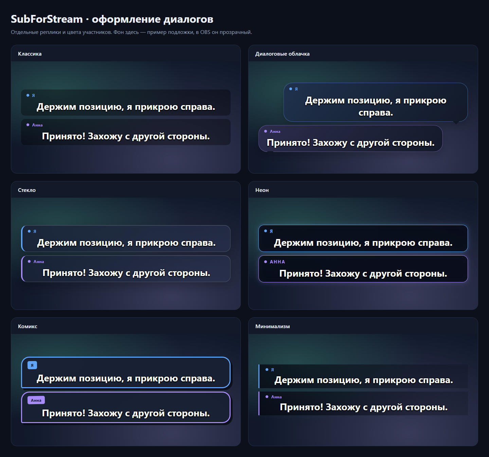
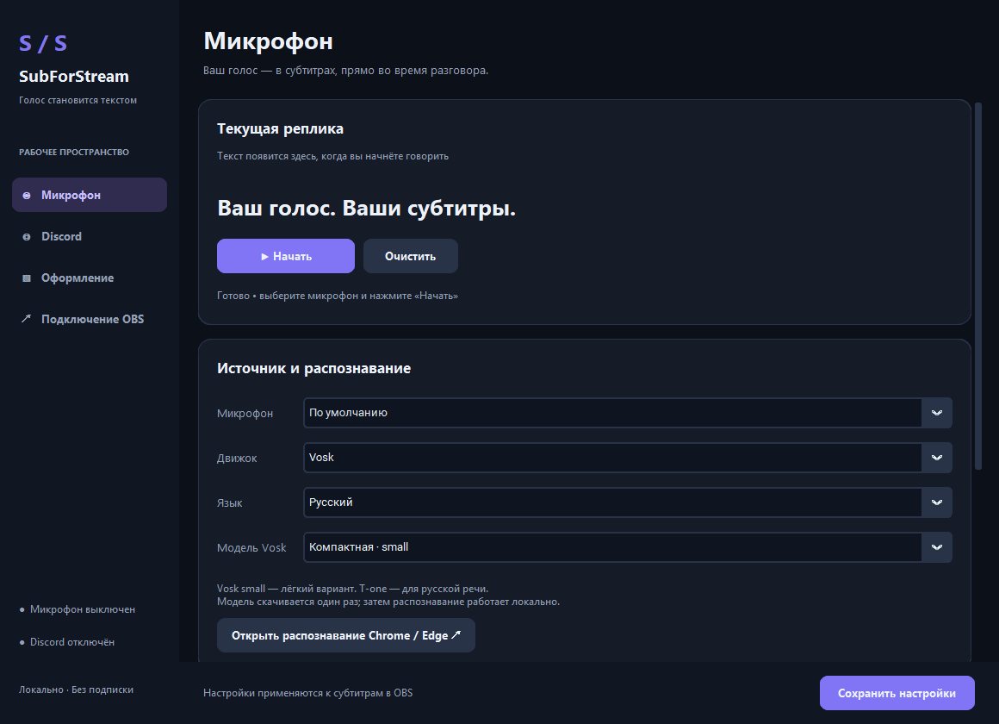
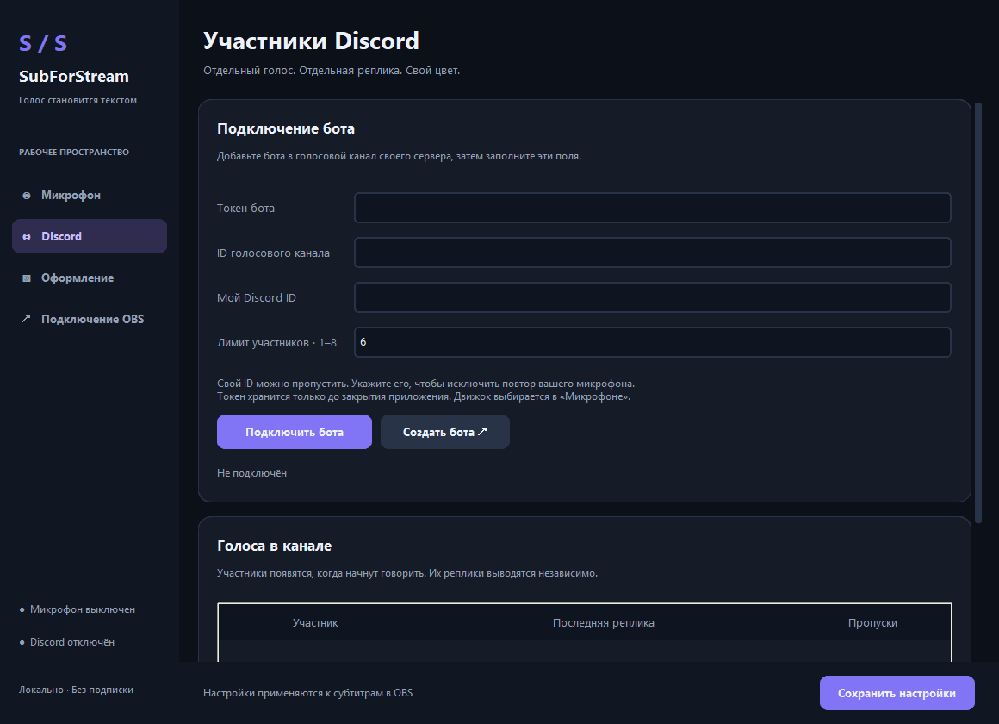

<div align="center">

# SubForStream

**Живые субтитры для стрима в OBS. Бесплатно, локально, без подписок и API-ключей.**

Говорите — зрители видят текст на экране через доли секунды.
Подключите Discord — и субтитры появятся у каждого участника голосового канала, со своим именем и цветом.

[**⬇ Скачать**](https://github.com/Rayness/SubsForStream/releases/latest) ·
[Настройка за 2 минуты](#быстрый-старт) ·
[Discord](DISCORD_SETUP.md) ·
[Вопросы](#частые-проблемы) ·
[Поддержать ❤](https://boosty.to/rayness)




</div>

## Зачем это стримеру

- **Зрители без звука** — многие смотрят стримы в метро, на работе или с выключенным звуком.
- **Глухие и слабослышащие зрители** смогут следить за тем, что вы говорите.
- **Кооп и командные игры** — видно, кто из тиммейтов что сказал, даже когда все говорят разом.
- **Клипы и нарезки** — субтитры уже вшиты в картинку.

## Возможности

|  |  |
| --- | --- |
| 🎙 **Распознавание на вашем ПК** | Vosk и T-one работают офлайн. Никаких облаков, лимитов и оплаты за минуты. |
| ⚡ **Текст во время речи** | Слова появляются сразу и уточняются, пока вы договариваете фразу. |
| 👥 **Discord-бот** *(бета)* | До 8 участников голосового канала, у каждого своя плашка, имя и цвет. |
| 🎨 **6 тем оформления** | Классика, диалоговые облачка, стекло, неон, комикс, минимализм. |
| 🛠 **Гибкая настройка** | Шрифт, цвет, фон и прозрачность, положение на экране, анимация, время показа. |
| 🤬 **Цензура мата** | Ругательства во всех словоформах заменяются звёздочками, можно добавить свои слова. |
| 🇷🇺 🇬🇧 **Два языка** | Русский и английский. |
| 🪶 **Лёгкое** | Компактная модель весит ~45 МБ и не занимает видеокарту, нужную игре и OBS. |

<p align="center">
  
</p>

## Быстрый старт

1. **Скачайте** архив со страницы [Releases](https://github.com/Rayness/SubsForStream/releases/latest) и распакуйте **всю папку** в любое место.
2. **Запустите** `SubForStream.exe`, выберите микрофон и язык.
3. Нажмите **«Начать»**. При первом запуске скачается модель распознавания (один раз, дальше всё работает без интернета).
4. В OBS: **Источники → + → Браузер**
   - URL: `http://localhost:5000`
   - Ширина и высота: как у сцены, например `1920 × 1080`
5. Скажите что-нибудь — субтитры появятся в OBS. 🎉

> 💡 Кнопка **«Показать пример в OBS»** в разделе «Оформление» выводит тестовые реплики без микрофона — удобно подбирать стиль.

Закрытие окна сворачивает программу в трей. Полностью выйти можно через значок в трее → «Выход».

## Какой движок выбрать

| Движок | Языки | Когда выбирать |
| --- | --- | --- |
| **Vosk small** | RU, EN | Начните с него: лёгкий и быстрый, подходит слабым ПК |
| **Vosk large** | RU, EN | Если хватает памяти и хочется попробовать точнее |
| **T-one** | RU | Нейросетевая модель, часто точнее на русской речи |
| **Chrome / Edge** | RU, EN | Распознавание браузера; нужен интернет |

Качество зависит от микрофона, фона и дикции — попробуйте пару вариантов на своём голосе.
Модели хранятся в `%LOCALAPPDATA%\SubForStream\models`.

## Discord: субтитры для всей команды

Бот заходит в голосовой канал вашего сервера и распознаёт каждого участника отдельно.



Пошаговая инструкция по созданию бота: **[DISCORD_SETUP.md](DISCORD_SETUP.md)**.

- Токен бота не сохраняется на диск — его нужно вводить при каждом запуске.
- Если одновременно включены микрофон и Discord, укажите свой Discord ID, чтобы ваш голос не дублировался.
- Работает в голосовых каналах серверов. Личные звонки и Stage-каналы не поддерживаются.

## Частые проблемы

<details>
<summary><b>В OBS не появляется текст</b></summary>

- Проверьте, что в приложении нажата кнопка «Начать» и текст виден в поле «Текущая реплика».
- Убедитесь, что запущена **только одна** копия SubForStream (проверьте трей). Две копии не могут работать на одном порту.
- В свойствах источника «Браузер» в OBS нажмите **«Обновить кэш текущей страницы»**.
- Откройте `http://localhost:5000` в обычном браузере: если текст там есть, дело в настройках источника OBS.
</details>

<details>
<summary><b>«Не удалось запустить сервер на порту 5000»</b></summary>

Программа уже запущена (посмотрите в трей) или порт занят другим приложением.
Порт меняется в разделе «Подключение OBS» и применяется после перезапуска. Не забудьте обновить URL в OBS.
</details>

<details>
<summary><b>Субтитры запаздывают или пропускают слова</b></summary>

Посмотрите счётчик «Пропущено блоков» в окне программы. Если он растёт, процессору не хватает ресурсов —
выберите Vosk small или снизьте нагрузку от игры и кодирования.
</details>

<details>
<summary><b>Цензура заглушает звук?</b></summary>

Нет. Цензура меняет только текст субтитров, звук микрофона остаётся как есть.
</details>

<details>
<summary><b>Windows Defender / SmartScreen ругается на exe</b></summary>

Программа не подписана платным сертификатом, поэтому SmartScreen может показать предупреждение.
Нажмите «Подробнее → Выполнить в любом случае» или соберите программу из исходников — инструкция ниже.
</details>

## Для разработчиков

<details>
<summary><b>Запуск из исходников</b></summary>

Нужны Windows 10/11 x64, Python 3.13 и Git. Для Discord ещё Node.js (проверено на 24.17.0).

```powershell
git clone https://github.com/Rayness/SubsForStream.git
cd SubsForStream
py -3.13 -m venv .venv
.venv\Scripts\python.exe -m pip install -r requirements.txt
npm ci --prefix discord_bridge   # только для Discord
.venv\Scripts\python.exe launcher.py
```
</details>

<details>
<summary><b>Сборка EXE</b></summary>

```powershell
.venv\Scripts\python.exe -m pip install -r requirements-dev.txt
npm ci --prefix discord_bridge
Copy-Item (Get-Command node.exe).Source discord_bridge\node.exe
.venv\Scripts\python.exe -m PyInstaller --noconfirm --distpath dist-release SubForStream.spec
dist-release\SubForStream\SubForStream.exe --check
```

Распространяйте всю папку `dist-release/SubForStream` вместе с `_internal`.
При поставке другой версии Node.js обновите `discord_bridge/NODE-LICENSE`.
</details>

<details>
<summary><b>Тесты и замеры</b></summary>

```powershell
.venv\Scripts\python.exe -m pytest -q
.venv\Scripts\python.exe benchmarks\render.py
```

Браузерным тестам нужен установленный Chrome. Тесты T-one, Vosk и Discord пропускаются,
если модели или Node.js не установлены. Сами тесты ничего не скачивают.

Доставка уже распознанного текста до оверлея (headless Chrome, 8 фраз): медиана **3.45 мс** против 580 мс
в первой версии. Это замер вывода текста, а не задержки от речи до текста.
</details>

<details>
<summary><b>Как устроено</b></summary>

```
Микрофон / Discord ──► распознаватель (Vosk, T-one) ──► Flask + Socket.IO ──► OBS Browser Source
```

- `launcher.py`, `desktop_ui.py`, `desktop_select.py` — окно, трей и элементы интерфейса (CustomTkinter).
- `recognizer.py`, `models.py` — захват звука, ограниченная очередь, загрузка моделей.
- `server.py`, `static/overlay.*` — сервер на `127.0.0.1` и оверлей для OBS с темами.
- `discord_capture.py`, `discord_bridge/` — Discord-бот и отдельные потоки распознавания для участников.
- `settings.py`, `censor.py` — настройки и цензура.
- `tests/` — серверные, аудио-, браузерные и нативные тесты.
</details>

## Помочь проекту

- ⭐ **Поставьте звезду** — так проект легче найти другим стримерам.
- 🐞 Нашли баг или есть идея? Создайте [Issue](https://github.com/Rayness/SubsForStream/issues).
- 📣 Покажите субтитры на своём стриме и расскажите, где скачать программу.
- ❤ Поддержите разработку на **[Boosty](https://boosty.to/rayness)**.

---

<details>
<summary>🇬🇧 English</summary>

**SubForStream** is a free Windows app that adds live speech-to-text subtitles to OBS.
Recognition runs offline on your PC (Vosk / T-one), with no API keys or subscriptions.
It supports Russian and English, 6 subtitle themes, profanity filtering,
and an optional Discord bot that captions up to 8 voice-channel members separately.

Download the latest build from [Releases](https://github.com/Rayness/SubsForStream/releases/latest), run it,
press **Start**, then add a Browser Source in OBS pointing to `http://localhost:5000`.
</details>
